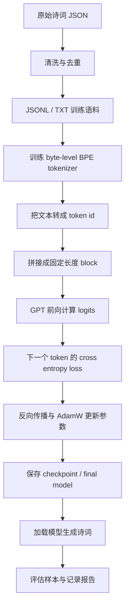

# 00 项目地图与整体链路

这一章先建立全局视角。你需要知道项目里哪些文件是数据，哪些是脚本，哪些是训练产物，以及一次从零预训练会经过哪些阶段。

## 项目结构

核心目录如下：

```text
.
├── README.md
├── requirements-training.txt
├── docs/
│   └── pretraining_from_scratch.md
├── learning/
│   └── 本系列教程
├── scripts/
│   ├── build_poetry_corpus.py
│   ├── train_tokenizer.py
│   ├── train_tiny_gpt.py
│   ├── generate_poetry.py
│   ├── train_pytorch_gpt.py
│   ├── generate_pytorch_gpt.py
│   ├── check_training_environment.py
│   └── verify_pretraining_pipeline.py
├── data/
│   ├── raw/
│   └── processed/
└── artifacts/
    ├── poetry-bpe-tokenizer/
    ├── poetry-gpt-tiny-body/
    └── verification/
```

你可以把它理解成四层：

| 层 | 目录 | 作用 |
| --- | --- | --- |
| 原料层 | `data/raw/` | 从上游仓库下载的原始诗词 JSON。 |
| 数据层 | `data/processed/` | 清洗、去重、切分后的训练语料。 |
| 脚本层 | `scripts/` | 构建数据、训练 tokenizer、训练模型、生成、验证。 |
| 产物层 | `artifacts/` | tokenizer、checkpoint、最终模型、报告、样本。 |

## 一次完整预训练发生了什么



这条链路里每一步都可以被验证。不要把“能训练”只理解为命令跑完；真正可靠的训练应该满足：

- 数据文件存在且可解析。
- tokenizer encode/decode 中文样本后仍可读。
- 模型 forward 得到有限 loss，不是 `nan` 或 `inf`。
- 短训练能保存 checkpoint。
- checkpoint 能重新加载。
- 生成文本非空，并包含中文。
- loss 有记录，整体趋势合理。

## 两条教程线

本项目有两套训练路线。

### Hugging Face 工程线

主要脚本：

```text
scripts/train_tiny_gpt.py
scripts/generate_poetry.py
```

特点：

- 复用 Transformers 的 `GPT2LMHeadModel` 和 `Trainer`。
- 模型权重仍然是随机初始化，不是加载预训练模型。
- 适合正式训练、保存、恢复、评估和后续扩展。

你应该优先用这条线跑完整训练。

### 手写 PyTorch 原理线

主要脚本：

```text
scripts/train_pytorch_gpt.py
scripts/generate_pytorch_gpt.py
```

特点：

- 手写 token embedding、position embedding、causal self-attention、MLP、LayerNorm、训练循环。
- 适合理解 Transformer 的内部结构。
- 不追求工程功能完备，不建议作为长训练主力。

你应该用这条线理解“模型到底在算什么”。

## 重要产物说明

### 处理后的数据

```text
data/processed/poems_shi_ci_dedup.jsonl
data/processed/pretrain_shi_ci_body.txt
```

`poems_shi_ci_dedup.jsonl` 是结构化数据，每行一首或一阕，包含正文、题目、作者、朝代、来源等字段。

`pretrain_shi_ci_body.txt` 是纯正文文本，更适合训练 tokenizer 或正文语言模型。

### tokenizer

```text
artifacts/poetry-bpe-tokenizer/
```

里面通常有：

```text
tokenizer.json
tokenizer_config.json
vocab.json
merges.txt
```

模型训练和生成都要用同一个 tokenizer。换 tokenizer 等于换了 token id 的语言，旧模型不能随便复用。

### 最终 HF 模型

```text
artifacts/poetry-gpt-tiny-body/
```

关键文件：

```text
config.json
generation_config.json
model.safetensors
tokenizer.json
tokenizer_config.json
training_args.bin
train.log
checkpoint-3000/
checkpoint-4000/
checkpoint-5000/
```

`model.safetensors` 是最终权重；`config.json` 描述模型结构；`tokenizer.json` 让生成脚本知道如何把文字和 token id 互相转换。

### 验证产物

```text
artifacts/verification/
```

这个目录来自一键验证脚本。它不是正式训练模型，而是小规模 smoke test，用来证明链路可靠。

## 本章检查点

读完这一章，你应该能回答：

- 训练用的数据在哪里？
- tokenizer 和模型分别保存在哪里？
- Hugging Face 工程线和手写 PyTorch 原理线有什么区别？
- 为什么最终模型目录需要同时有权重、配置和 tokenizer？

下一章开始准备环境和检查数据。

